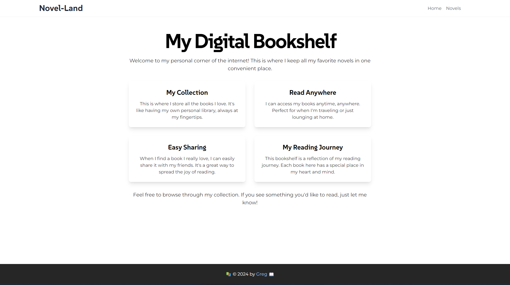

# Novel-Land

A personal digital bookshelf for storing and reading favorite novels.

[Visit Novel-Land](https://novel-land.vercel.app/)


## Features

- React 18 with TypeScript
- Vite for fast development and building
- Tailwind CSS for utility-first styling
- shadcn/ui for beautifully designed, accessible components
- React Router for client-side routing
- Framer Motion for smooth animations
- Biome for linting and formatting
- Custom components and utilities for enhanced UI/UX
- EPUB reader functionality

## Tech Stack

- [React](https://reactjs.org/)
- [TypeScript](https://www.typescriptlang.org/)
- [Vite](https://vitejs.dev/)
- [Tailwind CSS](https://tailwindcss.com/)
- [shadcn/ui](https://ui.shadcn.com/)
- [React Router](https://reactrouter.com/)
- [Framer Motion](https://www.framer.com/motion/)
- [Biome](https://biomejs.dev/)
- [epubjs](https://github.com/futurepress/epub.js/)

## Getting Started

1. Clone the repository
2. Install dependencies:
   ```bash
   npm install
   ```
3. Start the development server:
   ```bash
   npm run dev
   ```

## Available Scripts

- `npm run dev`: Start the development server
- `npm run build`: Build the production-ready application
- `npm run lint`: Run Biome linter
- `npm run preview`: Preview the built application
- `npm run generate-novels`: Generate the novel list from EPUB files

## Project Structure

- `src/`: Source files
  - `components/`: Reusable React components
  - `layout/`: Layout components (Header, Footer, Layout)
  - `pages/`: Page components
  - `lib/`: Utility functions
  - `utils/`: Helper functions
- `public/`: Static assets
  - `novels/`: EPUB files and cover images

## Custom Components

This project includes several custom components to enhance the reading experience:

1. Novel Viewer: A custom EPUB reader component
2. Novel List: A grid display of available novels
3. Gradual Spacing Text Animation

## Customization

- Tailwind CSS configuration: `tailwind.config.js`
- Biome configuration: `biome.json`
- TypeScript configuration: `tsconfig.json`

## Contributing

Contributions are welcome! Please feel free to submit a Pull Request.

## License

This project is open source and available under the [MIT License](LICENSE).
